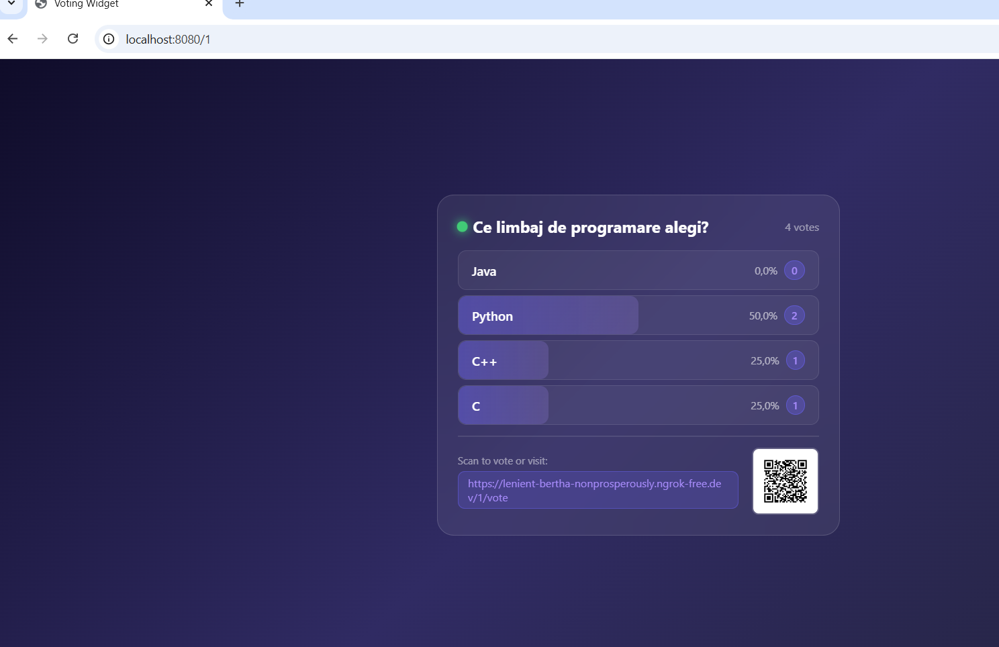
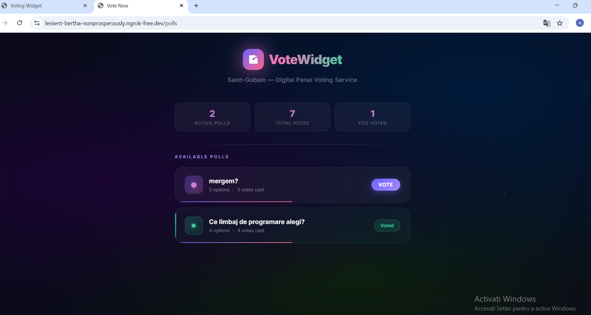
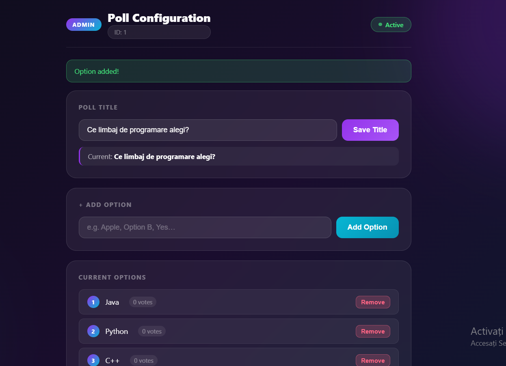

# Voting Widget Service - Summer Practice Assessment

##  Overview
This project is a self-contained Voting Widget Service designed to be embedded inside a digital information panel via an iframe. It handles multiple voting polls dynamically, based solely on a provided identifier (`poll_id`). 

## Public Access & Live Demo
* **Live Voting URL:** `https://lenient-bertha-nonprosperously.ngrok-free.dev`
* This link is publicly accessible worldwide via an ngrok tunnel. Anyone can open the voting page on their device and cast a vote in real-time.

## Core Features & Requirements Met
The application fully fulfills the core requirements and bonus enhancements specified in the assessment:

* **Implicit Poll Creation:** There is no explicit "create poll" operation. A poll is implicitly initialized when data (like a title or an option) is first written via the Admin page.
* **Invalid State Handling:** If a poll (`poll_id`) is accessed but has no stored data, it is correctly treated as invalid, displaying the "Invalid or uninitialized voting poll" message.
* **Three Core Endpoints:**
  1. `/<poll_id>`: The display widget. It adapts to the iframe viewport, shows the title, options, current votes, and a link/QR code to vote.
  2. `/<poll_id>/vote`: The public voting page allowing users to submit a vote without authentication.
  3. `/<poll_id>/admin`: The admin dashboard to configure the poll, set titles, and add options.

## Bonus Feature: Duplicate Vote Prevention
* **Implementation:** I successfully implemented the bonus requirement to prevent duplicate votes per device.
* **How it works:** The system uses cookies to remember if a device has already voted on a specific poll. If a user votes, closes the app, and reopens it, the system displays an "Already Voted" state for that specific poll. They are restricted from voting again on that poll but can still participate in other active polls.

## Testing and Integration
The application was thoroughly tested in two environments:
1. **Local Environment:** Verified endpoint routing, H2 Database (in-memory) persistence, and cookie-based validation.
2. **Digital Panel Integration:** Successfully deployed and tested within the provided `https://dp.multhingverse.com/` platform. The widget scales perfectly inside the iframe, and the admin panel was successfully accessed via the "Manage placement instance" layout feature.

##  Screenshots

### 1. Widget View (Embedded in Digital Panel)

### 2. Voting Page & "Already Voted" Prevention

### 3. Admin Dashboard

##  How to Build and Run Locally
1. **Prerequisites:** Java 23 and Maven.
2. **Database:** The project uses an in-memory **H2 Database** for easy setup with zero configuration required (no MySQL installation needed).
3. **Build the Project:** Navigate to the project root directory and run:
   `mvn clean package -DskipTests`
4. **Run the Application:** `mvn spring-boot:run`
5. Access the application locally at `http://localhost:8080/`.